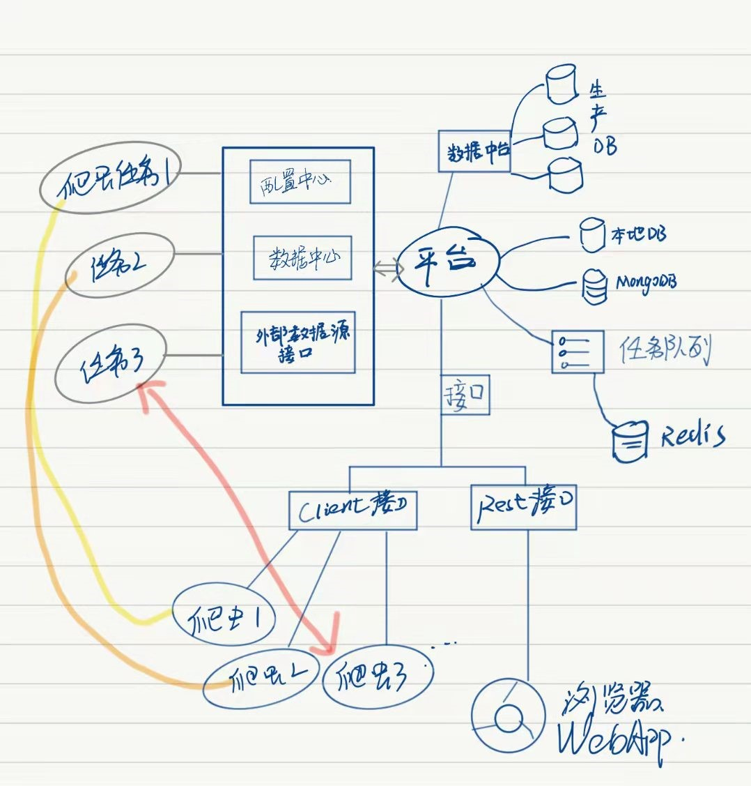
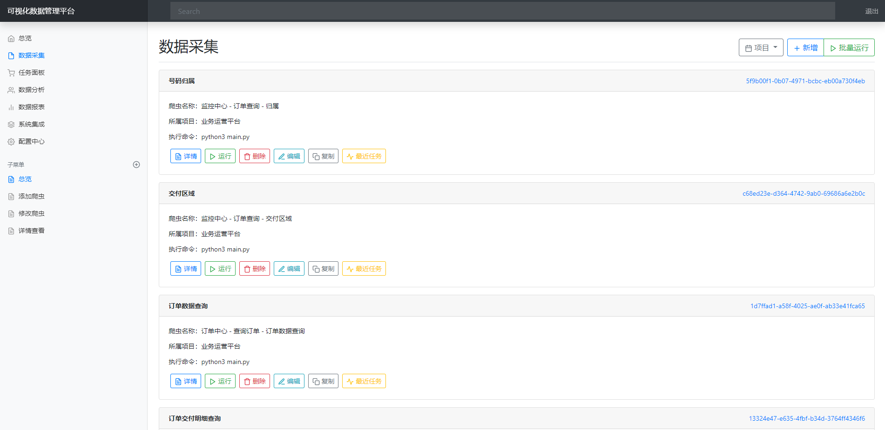
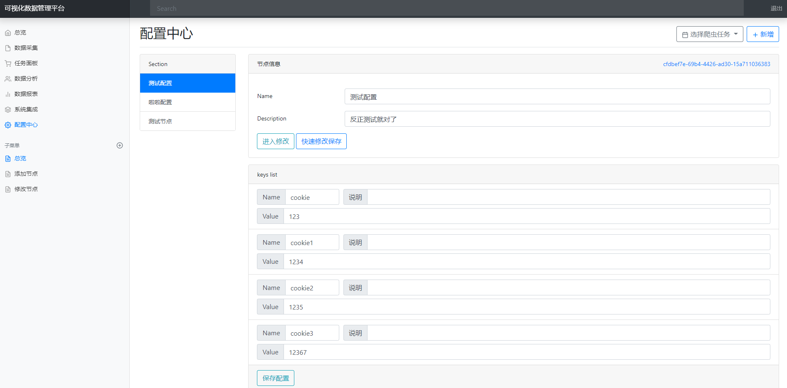
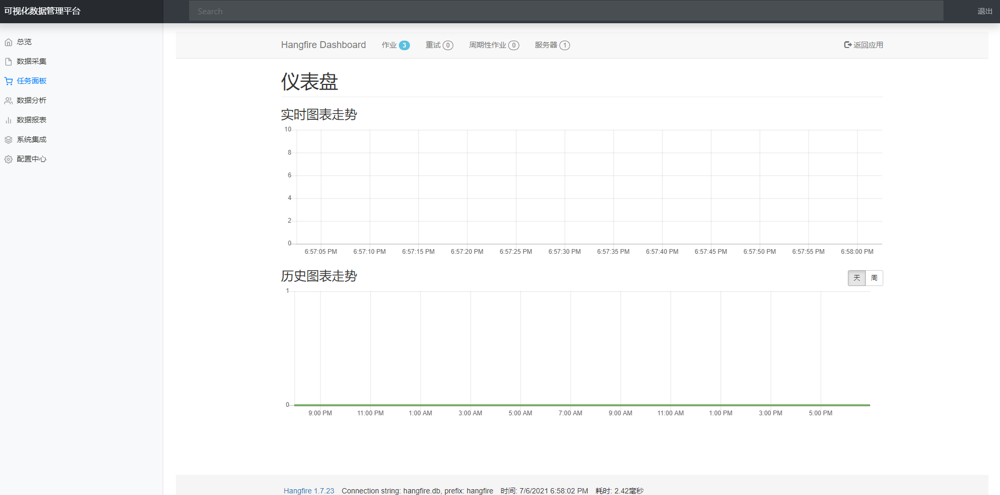

# CrawlCenter

可视化的分布式爬虫管理工具（开发中）

## 技术

- Asp.Net Core
- FreeSql
- MongoDB
- Exceptionless
- Hangfire
- [Hangfire.Redis.StackExchange](https://github.com/marcoCasamento/Hangfire.Redis.StackExchange)
- OpenApi
- X.PagedList

## 第一版架构图

## 运行效果

## License

Apache License Version 2.0, January 2004

http://www.apache.org/licenses/